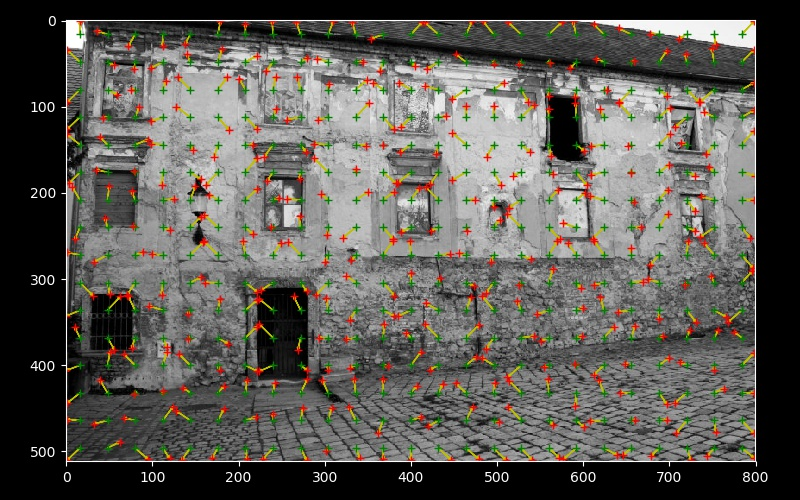

# Dense CNN image features

Implements the feature relocation idea in this paper:

    @Article{Widya2018,
    author="Widya, Aji Resindra
    and Torii, Akihiko
    and Okutomi, Masatoshi",
    title="Structure from Motion Using Dense CNN Features With Keypoint Relocalization",
    journal="IPSJ Transactions on Computer Vision and Applications",
    year="2018",
    month="May",
    day="31",
    volume="10",
    number="1",
    pages="6",
    issn="1882-6695",
    doi="10.1186/s41074-018-0042-y",
    url="https://doi.org/10.1186/s41074-018-0042-y"
    }

This implementation uses just VGG16, but could easily be expanded to other models.

## Requirements

*  pytorch
*  torchvision

## Usage

see the example : `example.py`
